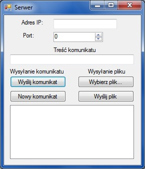
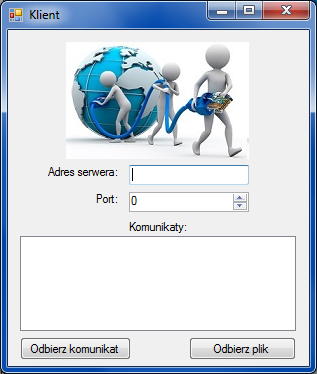

# Komunikator TCP (serwer-klient)

  

# Jak odpalić?

Należy dodać projekt aplikacji w Visual Studio (plik PZ\PZ.sln). Po otwarciu projektu należy go skompilować i uruchomić - serwer (PZ_serwer) oraz klienta (PZ_klient).

# Jak przetestować

W aplikacji serwer użytkownik podaje adres IP oraz port na którym będzie rozsyłany komunikat/plik.

Aby wysłać komunikat tekstowy: w polu tekstowym należy wpisać treść komunikatu i następnie kliknąć przycisk "Wyślij komunikat". Należy kliknąć "Nowy komunikat" żeby wysłać kolejny.

Aby wysłać plik należy wskazać dany plik z dysku poprzez przycisk "Wybierz plik..." i następnie kliknąć "Wyślij plik".

W aplikacji klient użytkownik podaje adres IP oraz port, na którym został uruchomiony serwer. Po wpisaniu danych należy kliknąć "Odbierz komunikat" aby odebrać komunikat lub "Odbierz plik" aby odebrać plik z serwera.

# Opis działania
 
Aplikacja serwer wysyła komunikat tekstowy lub plik na podanym adresie IP oraz porcie protokołu TCP. Użytkownik może podać adres IP, port oraz treść komunikatu lub wybrać plik. W kliencie można odebrać komunikat/plik podając adres IP i port serwera.

Obie aplikacje stworzone zostały z użyciem bibliotek Windows.Forms, .Net, .Net.Sockets, .IO.

# Propozycje TODO

- rozbudować logowanie o: dane klientów, zmienić na zapis do bazy danych itp.
- dodać listę połączonych klientów i zarządzanie nimi
- dodać możliwość zablokowania klienta na danym IP/porcie
- rozbudować GUI
